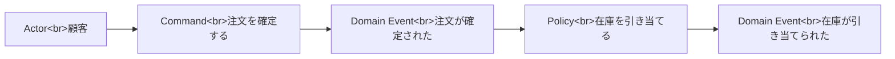

# Event Storming

Event Storming は、業務で起きる出来事を中心にモデルを見つけるワークショップです。最初にクラスや DB を考えず、業務イベントを時系列に並べます。

代表的には、Domain Event、Command、Actor、Policy、External System、Read Model などを付箋で表します。

Event Storming は、正しい図を作ることより、関係者の認識のズレを早く見つけることが目的です。

**イベントから考えると、業務の流れと言葉の違和感を発見しやすくなります。**
