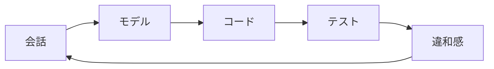

# モデルの見直し方

モデルは最初から正解になりません。実装してみて、テストを書いて、業務担当者と話して、違和感を見つけながら変えます。

見直しのきっかけは、Service に `if` が増える、DTO と Entity の変換が複雑になる、同じ言葉の意味が揺れる、Aggregate が大きくなりすぎる、などです。

モデル変更は失敗ではありません。理解が進んだ結果です。

**DDD のモデルは、作るものではなく育てるもの**です。
