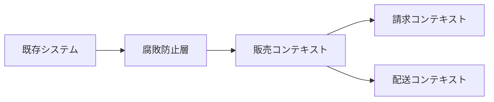

# コンテキストマップ

コンテキストマップは、境界づけられたコンテキスト同士の関係を見える化する図です。どのモデルがどのモデルに依存しているか、どこで変換が必要かを整理します。

関係には、上流と下流、共有カーネル、顧客と供給者、腐敗防止層などがあります。重要なのは、連携方式そのものよりも、モデルの影響範囲を明らかにすることです。

外部システムや既存システムのモデルをそのまま内部に入れると、内部モデルが相手の都合で変わりやすくなります。

**コンテキストマップは、連携の線ではなくモデルの力関係を見るための道具**です。
