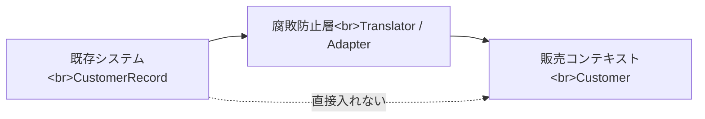

# 腐敗防止層

腐敗防止層は、外部システムや既存システムのモデルが、自分たちのドメインモデルに入り込むのを防ぐ境界です。外部の都合をそのまま内部に持ち込むと、内部モデルが相手の変更理由で歪みます。

たとえば既存システムの `CustomerRecord` が、販売、請求、サポートの都合をすべて持っている場合、それをそのまま `Customer` Entity にしないようにします。

腐敗防止層では、名前の変換だけでなく、意味の変換を行います。外部では `status = 9` が退会を意味するなら、内部では `CustomerStatus.Withdrawn` のように表します。

**外部モデルと内部モデルを同じ型にしない**ことが、境界を守る第一歩です。
