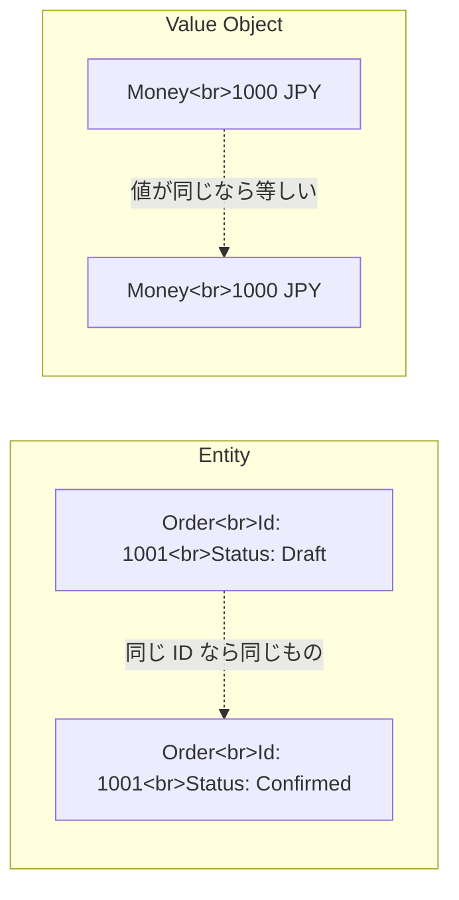

# Value Object

Value Object は、同一性ではなく値そのもので比較するオブジェクトです。金額、期間、メールアドレス、住所など、値のまとまりに意味や制約がある場合に使います。

Value Object は不変にします。作成時に制約を満たしていれば、その後に壊れた状態へ変わりません。



```csharp
public readonly record struct Money(decimal Amount, string Currency)
{
    public Money
    {
        if (Amount < 0) throw new ArgumentOutOfRangeException(nameof(Amount));
        if (string.IsNullOrWhiteSpace(Currency)) throw new ArgumentException("通貨が必要です。");
    }
}
```

`decimal amount` と `string currency` を別々に渡し続けると、組み合わせの意味がコードから消えます。Value Object にまとめると、値の意味と制約を近くに置けます。

**Value Object は、値に名前とルールを与えるための型**です。
