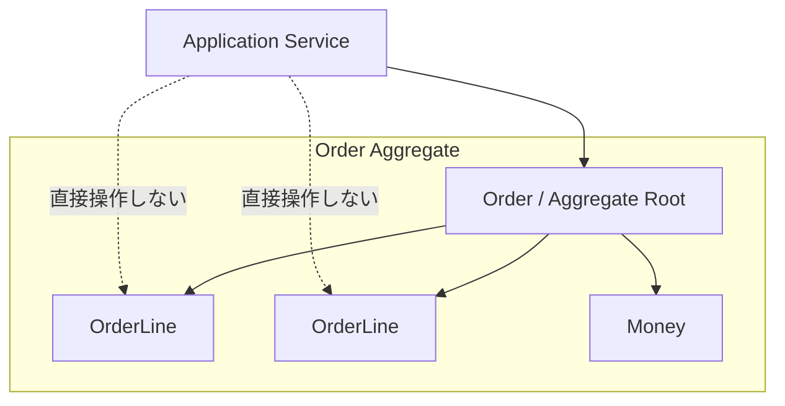

# Aggregate

Aggregate は、一貫性を守る単位です。複数の Entity や Value Object をまとめ、外部からは Aggregate Root を通して操作します。

注文と注文明細を考える場合、合計金額、明細数、注文状態などのルールを注文全体で守りたいなら `Order` を Aggregate Root にします。



```csharp
public sealed class Order
{
    private readonly List<OrderLine> _lines = [];
    public IReadOnlyCollection<OrderLine> Lines => _lines;

    public void AddLine(ProductId productId, Money unitPrice, int quantity)
    {
        if (Status != OrderStatus.Draft)
            throw new InvalidOperationException("確定後は明細を追加できません。");

        _lines.Add(new OrderLine(productId, unitPrice, quantity));
    }
}
```

Aggregate を大きくしすぎると、ロック、読み込み、変更の単位が重くなります。境界は「同時に守る必要がある不変条件」から考えます。

**Aggregate はオブジェクトの集まりではなく、一貫性を守る境界**です。
