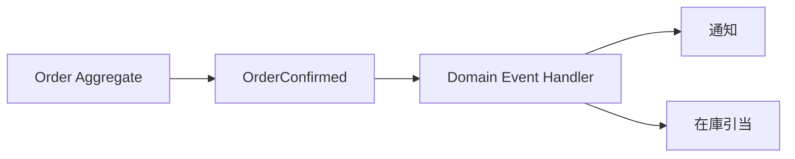

# Domain Event

Domain Event は、ドメイン内で起きた重要な事実を表します。命令ではなく、すでに起きたことなので、名前は過去形にします。

Aggregate の状態変更と一緒に記録すると、後続処理を直接呼ばずに分離できます。



```csharp
public sealed record OrderConfirmed(OrderId OrderId, DateTimeOffset OccurredAt);
```

Domain Event は、ドメイン内の事実を表すためのものです。外部システムへ公開するメッセージは、Integration Event として変換する方が安全です。

**Domain Event は、ドメインの重要な変化を明示するための型**です。
