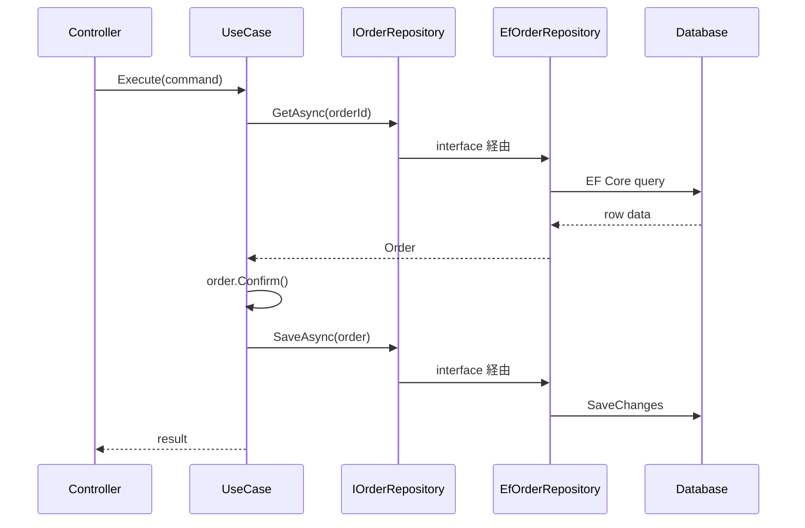

# Application Service

Application Service は、ユースケースの進行を担当します。入力を受け取り、必要な Aggregate を取得し、ドメインモデルのメソッドを呼び、永続化します。

Application Service に業務判断を置きすぎると、ドメインモデルはデータ構造だけになります。判断はドメインモデルへ寄せ、Application Service は流れを表す程度にします。



```csharp
public sealed class ConfirmOrderUseCase(IOrderRepository orders)
{
    public async Task ExecuteAsync(OrderId orderId, CancellationToken ct)
    {
        var order = await orders.GetAsync(orderId, ct);
        order.Confirm();
        await orders.SaveAsync(order, ct);
    }
}
```

ここで重要なのは `Confirm()` の中に業務ルールがあることです。Application Service は「いつ何を呼ぶか」を扱います。

**Application Service は、業務判断ではなくユースケースの進行を表す層**です。
