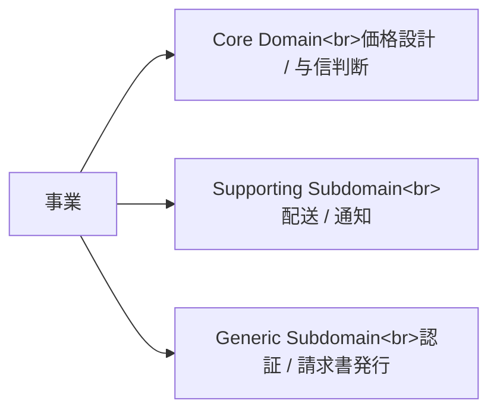

# Subdomain と Core Domain

Subdomain は、事業を成り立たせる業務領域を分けたものです。すべての Subdomain が同じ重要度ではありません。

| 種類 | 意味 | 方針 |
| --- | --- | --- |
| Core Domain | 競争優位の中心 | 最もよい人と時間を使う |
| Supporting Subdomain | 事業に必要だが差別化の中心ではない | 適度に作る |
| Generic Subdomain | 多くの会社で共通 | SaaS や既製品も検討する |

DDD では、すべてを丁寧に作るのではなく、どこに設計努力を集中するかを決めます。

**Core Domain を見極めることは、設計だけでなく投資判断**です。
