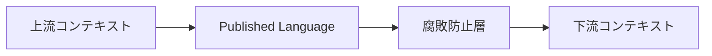

# Context Map の関係パターン

Context Map では、コンテキスト同士の線だけでなく関係の種類を見ます。関係を明示すると、どちらのモデルに合わせるか、どこで変換するかを判断しやすくなります。

| パターン | 意味 |
| --- | --- |
| Partnership | 双方が協調してモデルを調整する |
| Customer / Supplier | 上流が供給し、下流が利用する |
| Conformist | 下流が上流モデルに従う |
| Anti-Corruption Layer | 下流が変換層で自分のモデルを守る |
| Open Host Service | 上流が公開 API として提供する |
| Published Language | 公開された共通形式で連携する |
| Separate Ways | 連携せず別々に進む |

**関係パターンは、チーム間の力関係とモデルの守り方を表す言葉**です。
