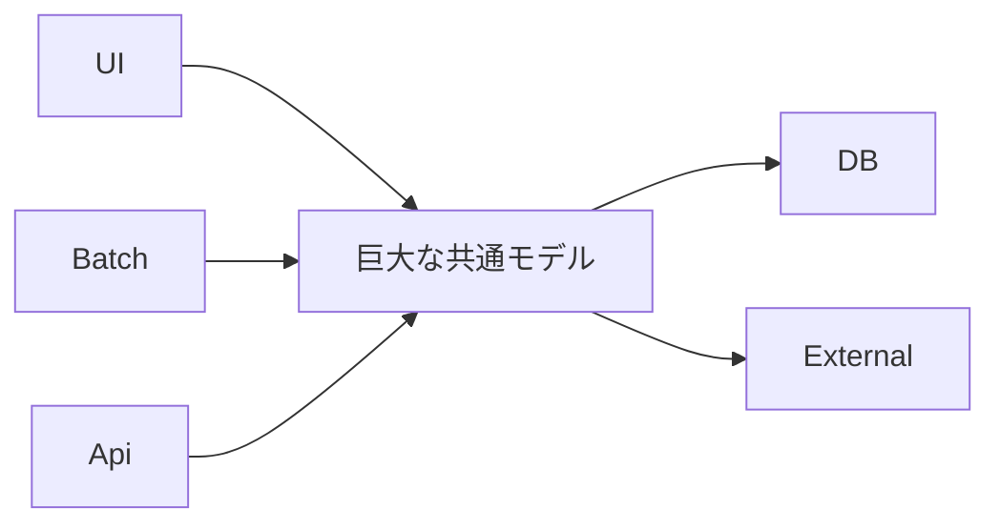

# Big Ball of Mud

Big Ball of Mud は、境界や責務が崩れて、何がどこに依存しているか分からない状態です。DDD では、この状態を避けるために言葉、境界、モデルを分けます。

兆候は、同じ用語が複数の意味で使われる、1 つのモデルに全業務の属性が集まる、変更の影響範囲が読めない、などです。

すでに泥団子になっている場合は、一気に作り直さず、変更頻度の高い業務から境界を切り出します。

**Big Ball of Mud を避けるには、境界を後回しにしすぎない**ことが大切です。
