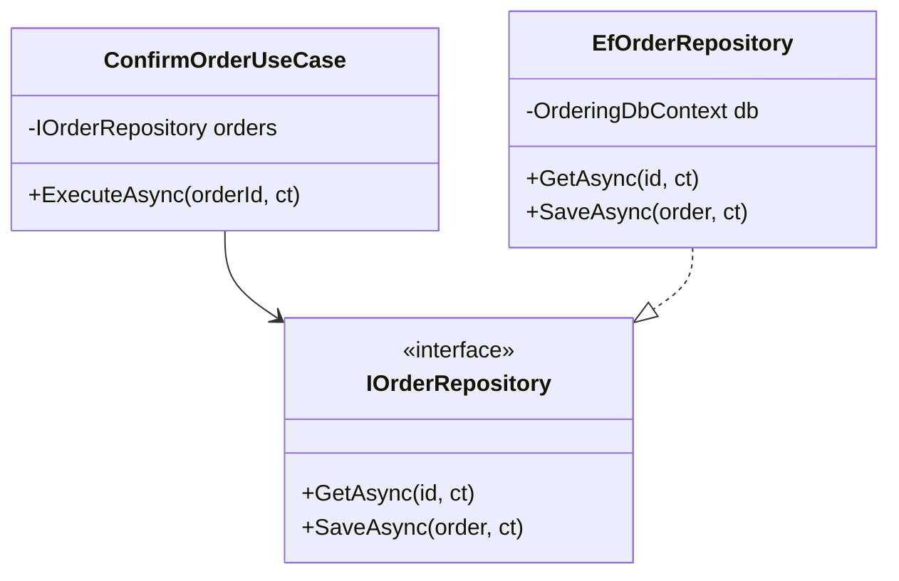

# Repository

Repository は、Aggregate の取得と保存を担当する抽象です。ドメイン層やアプリケーション層から、DB や ORM の詳細を直接扱わないようにします。

```csharp
public interface IOrderRepository
{
    Task<Order> GetAsync(OrderId id, CancellationToken ct);
    Task SaveAsync(Order order, CancellationToken ct);
}
```



Repository はテーブルごとではなく、Aggregate Root ごとに考えます。`OrderLineRepository` のように、Aggregate 内部の Entity を直接保存する Repository は境界を壊しやすくなります。

検索条件が複雑な一覧表示では、Repository ではなく Query Service や Read Model を分けることもあります。

**Repository は永続化の入口ではなく、Aggregate の永続化境界を表す**ものです。
