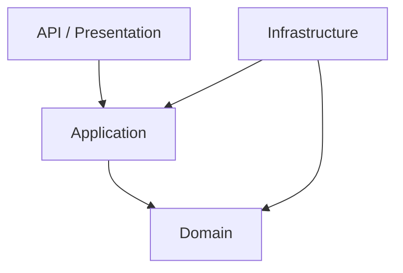

# Infrastructure への依存分離

Infrastructure は、DB、外部 API、ファイル、メッセージブローカーなど技術詳細を扱う層です。ドメイン層が Infrastructure に直接依存すると、業務ルールが技術詳細に引っ張られます。

依存方向は、内側のドメインへ向けます。Application 層は Repository インターフェースに依存し、実装は Infrastructure に置きます。

`DbContext` や HTTP Client を Entity に渡すと、テストしにくく、モデルの関心も混ざります。

**ドメイン層は、技術詳細を知らずに業務ルールを表せる状態**にします。
