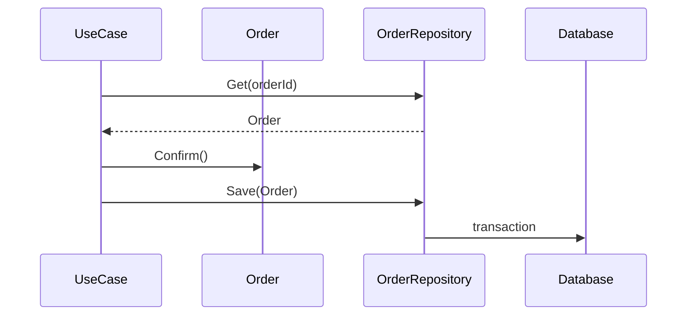

# トランザクション境界

トランザクション境界は、Aggregate 境界と近くなります。1 つのコマンドで 1 つの Aggregate を変更する形にすると、整合性と実装が読みやすくなります。

複数 Aggregate を同時更新したくなったら、境界が間違っているのか、結果整合性でよいのかを確認します。

**トランザクションで守るものと、イベントで伝えるものを分ける**と設計しやすくなります。
