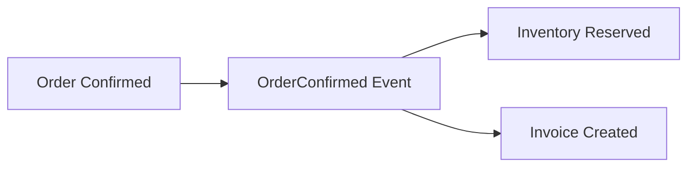

# 結果整合性

結果整合性は、すべてを同じトランザクションで更新せず、少し遅れて整合することを許す考え方です。複数 Aggregate や外部システムが関わる場合に使います。

```mermaid
flowchart LR
  Order[Order Confirmed]
  Event[OrderConfirmed Event]
  Inventory[Inventory Reserved]
  Billing[Invoice Created]

  Order --> Event
  Event --> Inventory
  Event --> Billing
```

結果整合性では、再試行、冪等性、失敗時の補償を考えます。単に非同期にするだけでは安全になりません。

**即時整合性が本当に必要かを問い直す**ことが、Aggregate を小さく保つ助けになります。
