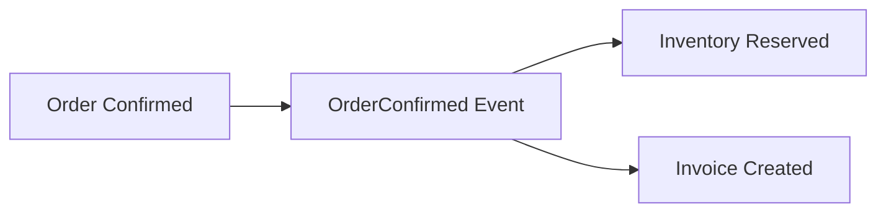

# 結果整合性

結果整合性は、すべてを同じトランザクションで更新せず、少し遅れて整合することを許す考え方です。複数 Aggregate や外部システムが関わる場合に使います。

結果整合性では、再試行、冪等性、失敗時の補償を考えます。単に非同期にするだけでは安全になりません。

結果整合性を使う場合は、ユーザーや業務担当者が「少し遅れて反映される」状態を受け入れられる必要があります。受け入れられないなら、Aggregate の境界やユースケースの単位を見直します。

また、処理の途中状態を画面や運用で説明できることも大切です。たとえば「注文は確定済み、請求は作成待ち」のように、状態を言葉で表せると扱いやすくなります。

**即時整合性が本当に必要かを問い直す**ことが、Aggregate を小さく保つ助けになります。
