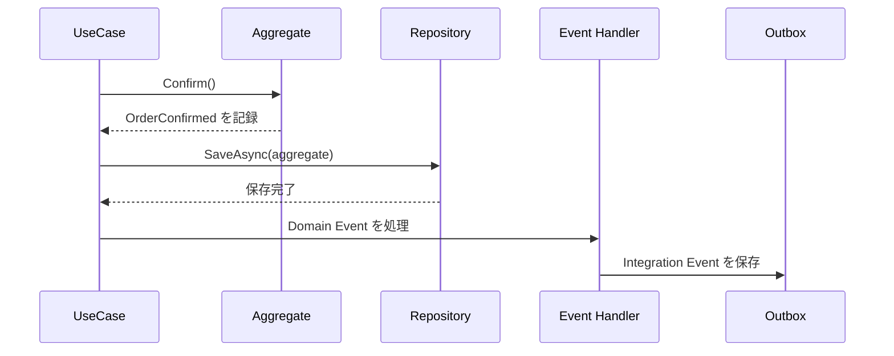

# 発行タイミング

Domain Event の発行タイミングは、設計によって変わります。Aggregate のメソッド内でイベントを記録し、保存後に Application Service や Unit of Work が処理する形がよく使われます。



```csharp
public void Confirm(DateTimeOffset now)
{
    if (Status != OrderStatus.Draft)
        throw new InvalidOperationException("下書き以外は確定できません。");

    Status = OrderStatus.Confirmed;
    AddDomainEvent(new OrderConfirmed(Id, now));
}
```

DB 保存前に外部通知すると、保存に失敗したのに通知だけ成功することがあります。DB 保存後に通知する場合も、通知失敗時の再試行を考える必要があります。

外部メッセージを確実に出したい場合は、Outbox パターンを検討します。

**イベント発行は、保存、通知、再試行の整合性をセットで考える**必要があります。
