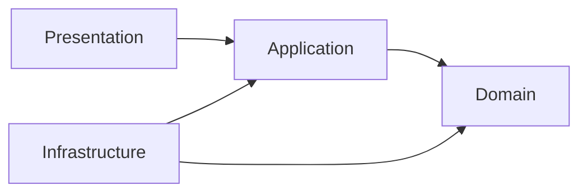

# 依存方向

依存方向は、外側から内側へ向けます。Domain は他の層に依存せず、Application は Domain に依存します。Infrastructure はインターフェースの実装として外側に置きます。

C# では、プロジェクト参照で依存方向を固定できます。Domain プロジェクトから Infrastructure プロジェクトを参照しないようにすると、ルール違反をコンパイル時に見つけやすくなります。

依存方向を守る目的は、テストしやすさだけではありません。業務ルールがフレームワークや DB の制約に引っ張られないようにするためです。

**依存の内側に置くほど、長く安定させたい概念を置く**と考えます。
