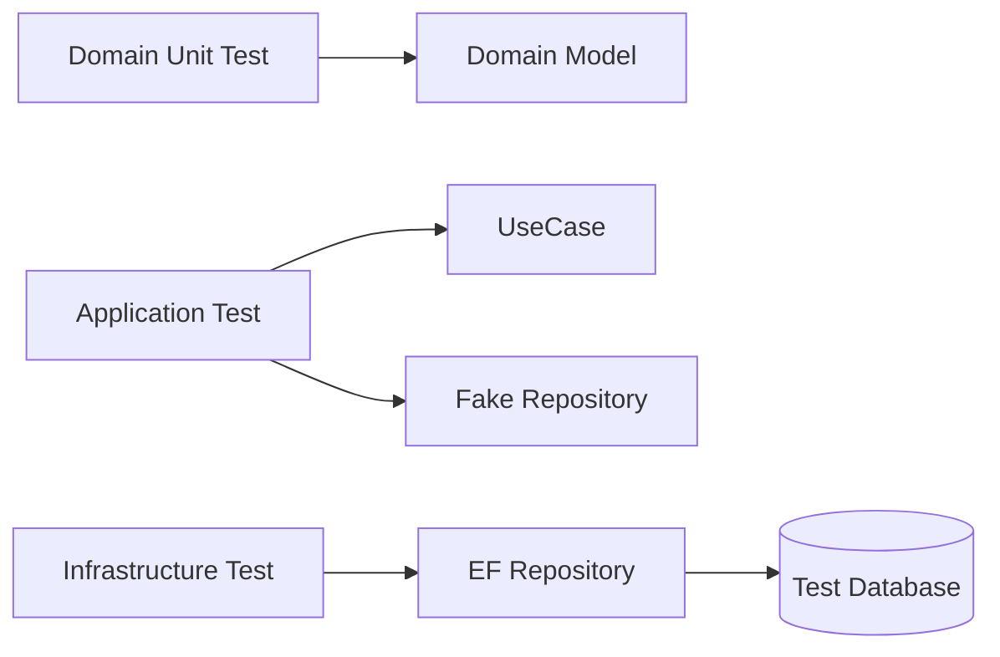

# テスト方針

DDD のテストでは、ドメインモデルのルールを最優先で守ります。Controller の配線よりも、業務上壊れてはいけない条件をテストします。

| 対象 | テストの観点 |
| --- | --- |
| Domain | Entity、Value Object、Aggregate の不変条件 |
| Application | UseCase の流れ、Repository 呼び出し、例外時の扱い |
| Infrastructure | EF Core マッピング、Repository 実装、外部連携 |
| Presentation | HTTP ステータス、入力変換、認証認可 |

Domain のテストは DB なしで速く書きます。Application のテストでは Repository を差し替えて、ユースケースの流れを確認します。Infrastructure のテストでは、実際の EF Core マッピングやクエリを確認します。

**テストはレイヤーごとの責務に合わせて分ける**と、失敗したときに原因を追いやすくなります。
