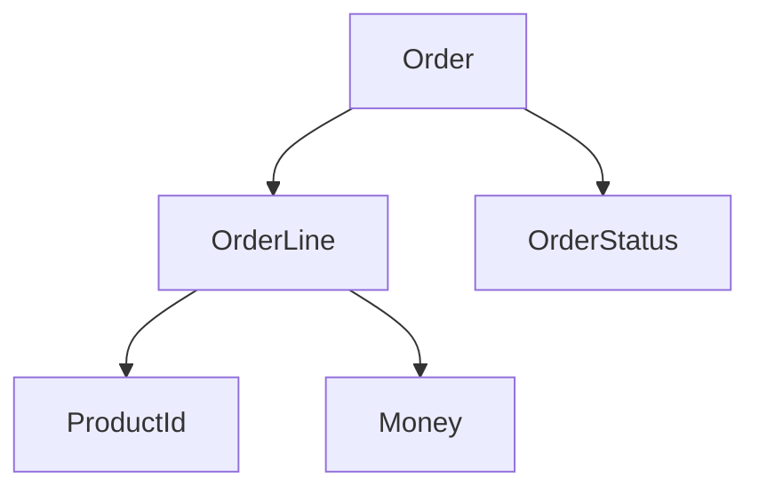

# 小さな注文モデル

実装例では、注文を題材にします。注文は、状態、明細、金額、確定、キャンセルなどのルールを持つため、DDD の基本要素を説明しやすい題材です。

最初から大きなモデルにしません。`Order`、`OrderLine`、`Money`、`OrderStatus` だけで、集約と値オブジェクトの使い方を確認します。

**小さな題材で、境界と責務を繰り返し確認する**のが実装例の目的です。
