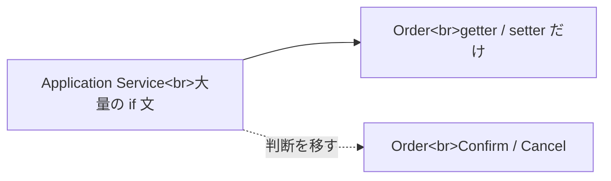

# ドメインモデル貧血症

ドメインモデル貧血症は、Entity が状態だけを持ち、業務ルールが Service 側に集まっている状態です。見た目は DDD の構成でも、判断がモデルにありません。

すべての処理を Entity に押し込む必要はありません。ただし、状態変更のルールがいつも外側にあるなら、モデルの責務を見直します。

**状態とルールが離れすぎると、変更時に不変条件を壊しやすくなります。**
