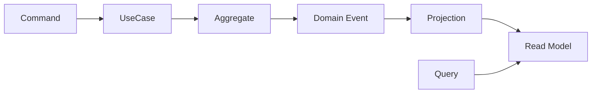

# CQRS

CQRS は、更新用モデルと参照用モデルを分ける考え方です。DDD では、Aggregate を更新の一貫性に集中させ、一覧や検索は Read Model に分けることがあります。

CQRS は必須ではありません。参照要件が複雑、検索が重い、更新モデルと表示モデルが大きく違う場合に検討します。

**Aggregate を画面表示の都合で太らせない**ために CQRS を使うことがあります。
