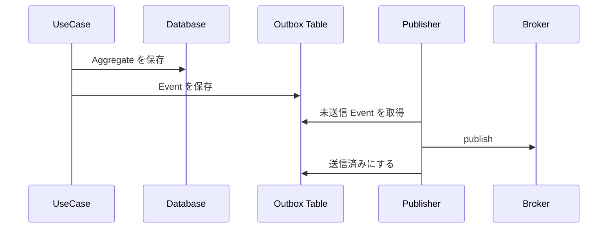

# Outbox Pattern

Outbox Pattern は、DB 更新と外部メッセージ送信の不整合を減らすためのパターンです。Aggregate の保存と同じトランザクションで Outbox テーブルにメッセージを保存し、別プロセスが送信します。

Outbox では、再送と冪等性が前提になります。受信側も同じメッセージを複数回受け取る可能性を考えます。

**外部送信は、DB トランザクションの外にある副作用として扱う**必要があります。
