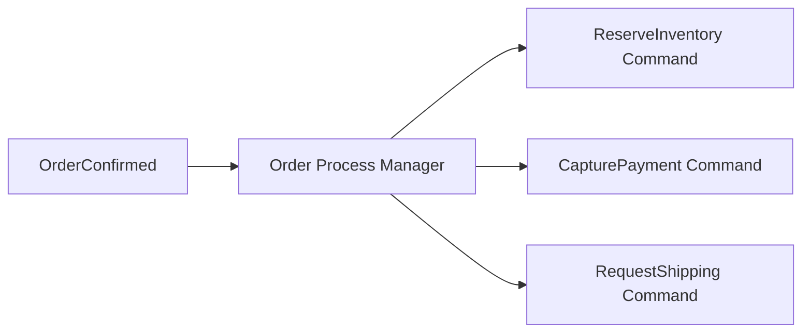

# Saga と Process Manager

Saga / Process Manager は、複数の Aggregate や外部サービスにまたがる長い業務プロセスを管理する考え方です。単一トランザクションで完結しない処理を、イベントとコマンドの連鎖で進めます。

例として、注文確定、在庫引当、決済、出荷依頼が別の境界にある場合があります。

Saga は便利ですが、流れが見えにくくなることがあります。プロセスの状態、再試行、補償処理を明示します。

**長い業務プロセスは、Aggregate に押し込まずプロセスとして表す**ことを検討します。
